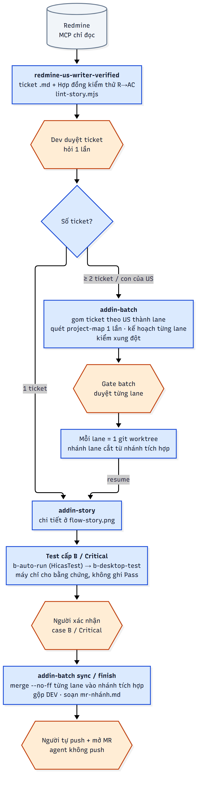

# Hicas Skills

Bộ kỹ năng & quy trình tự động hóa cho đội add-in **Revit / AutoCAD** (C#, .NET Framework 4.8), hỗ trợ cả **Antigravity IDE** (Model Gemini) và **Claude Code**.
Cấu trúc theo chuẩn [anthropics/skills](https://github.com/anthropics/skills) và
[Agent Skills spec](https://agentskills.io/specification).

## Plugin `hicas-bimcad`

Quy trình từ thu thập yêu cầu tới hiện thực hóa. Sau khi dev duyệt ticket, `redmine-us-writer-verified` tự chuyển tiếp:
1 ticket → `addin-story`, từ 2 ticket (hoặc con của một US) → `addin-batch`.



Chi tiết các phase của `addin-story`: [`docs/flow-story.png`](docs/flow-story.png). Nguồn sơ đồ là file Mermaid
(`docs/*.mmd`); cách sửa và sinh lại ảnh xem [`docs/README.md`](docs/README.md).

| Skill | Làm gì | Gọi |
|---|---|---|
| [`redmine-us-writer-verified`](skills/redmine-us-writer-verified/SKILL.md) | Đọc ticket qua MCP Redmine, viết `.md` cho dev agent kèm ma trận R→AC, oracle có nguồn, bằng chứng, người xác nhận | Tự kích hoạt khi nhắc ticket Redmine, hoặc `/hicas-bimcad:redmine-us-writer-verified <ID>` |
| [`addin-batch`](skills/addin-batch/SKILL.md) | Điều phối nhiều ticket: gom Task/Implement/Bug theo US, lập kế hoạch, kiểm xung đột, 1 lượt duyệt, chạy mỗi US trong git worktree riêng, hàng đợi test level B và MR | `/hicas-bimcad:addin-batch plan` |
| [`addin-story`](skills/addin-story/SKILL.md) | Team-lead playbook cho 1 ticket/US: test-first, maker ≠ checker, evaluator độc lập | `/hicas-bimcad:addin-story <file.md> [auto\|resume]` |
| [`b-auto-run`](skills/b-auto-run/SKILL.md) | Chạy tự động các case cấp **E** (logic/luồng/cảnh báo, qua cổng test) và cấp B (qua lệnh ribbon) trong Revit/AutoCAD thật bằng HicasTest, trên mọi năm deploy đã cài; gắn báo cáo máy vào `qa-handover.md`, ghi ledger. Không bao giờ ghi Pass | Từ addin-story Phase 5.4 / addin-batch khi `automationBridge` = `hicas-test`, hoặc `/hicas-bimcad:b-auto-run` |
| [`qa-test-session`](skills/qa-test-session/SKILL.md) | QA mô tả bằng lời, Claude điều khiển Revit/AutoCAD từng bước, chụp ảnh mỗi bước, xuất báo cáo | Tự kích hoạt khi QA nhờ test một tính năng, hoặc `/hicas-bimcad:qa-test-session` |
| [`b-desktop-test`](skills/b-desktop-test/SKILL.md) | **Tạm dừng** (từ 1.4.0). Claude lấy quyền điều khiển máy (computer-use) chạy kịch bản test tay trên bản copy fixture. Vướng quyền, chiếm máy, không chạy song song được; chỉ dùng khi người dùng yêu cầu rõ cho việc phải nhìn trên màn hình | `/hicas-bimcad:b-desktop-test` khi được yêu cầu |

Subagent đi kèm (`hicas-bimcad:<tên>`): `addin-scout`, `addin-implementer`, `addin-helper-writer`,
`addin-wpf-ui`, `addin-reviewer`, `explorer`, `test-writer`, `architect-reviewer`, `evaluator`.

MCP: plugin **không tự cài** server Redmine; cần một MCP server tên `redmine` (`mcp-redmine`). Hiện lấy từ plugin `harness-redmine`. Khi bỏ plugin đó, dùng cấu hình mẫu [`extras/redmine.mcp.json`](extras/redmine.mcp.json) (chỉ đọc mặc định, đọc biến môi trường).

MCP cho test tự động (tuỳ chọn): `b-auto-run` và `qa-test-session` cần tool
[HicasTest](https://github.com/longpl-1902/hicas-bimcad-test-tool) cài trên máy có Revit/AutoCAD, với MCP server tên
`hicas-test`. Cách nhanh nhất: chạy `install.ps1 -RegisterMcp` trong gói HicasTest; hoặc dùng mẫu
[`extras/hicas-test.mcp.json`](extras/hicas-test.mcp.json). Trong repo add-in, đặt `automationBridge: "hicas-test"`,
`testBuilds`, `testFixtures` (một hoặc nhiều thư mục/file, ổ bất kỳ hoặc ổ mạng; hoặc chỉ định file khi chạy) trong `.harness/addin-story.json`. Kết quả của tool chỉ là bằng chứng máy — case cấp B
vẫn cần người xác nhận.

## Quy ước cổng test (test entries) và cấp E — từ 1.5.0

Logic, cảnh báo và luồng của một tính năng được test bằng agent trong host không ai thao tác, qua MCP `hicas-test`
(`list_entries` / `call_entry`, chạy case `run.mode: entries`; thiết kế ở `docs/test-entries.md` của repo HicasTest, đã chạy thật trên Revit 2024 với `samples/SampleEntries`, **chưa pilot trên add-in thật**).
Giao diện nằm ngoài phạm vi (add-in tự viết unit test view model). Quy ước chi tiết:
[`skills/addin-story/references/test-entries.md`](skills/addin-story/references/test-entries.md). Tóm tắt:

- Tách tính năng thành các method nhỏ: `Validate` → `Plan` → `Apply`, use case `Execute` ghép chúng.
- Cảnh báo/xác nhận trong luồng chính đi qua `IUserPrompt` (id cố định, mức, lựa chọn, mặc định), không bao giờ mở cửa sổ;
  test ghi lại mọi prompt và trả lời theo kịch bản (nhánh "tiếp tục" và "huỷ" là hai case riêng).
- **Cổng chính** `feature.action` gọi cả use case (cùng thứ lệnh ribbon gọi); **cổng phụ** `.validate` / `.plan` (chỉ đọc) / `.apply`
  cho agent xem cảnh báo và kế hoạch mà không ghi model. Cả hai nằm trong assembly test (`<Addin>.Testing.dll`), không phát hành.
- Lệnh ribbon chỉ là lớp mỏng: dựng request, gọi cùng use case; mỗi tính năng có file hợp đồng `docs/specs/test-entries/*.yaml`.
- **Cấp E** trong hợp đồng kiểm thử (cạnh A và B): cần host nhưng không cần người, chạy bằng cổng test. Kết quả `MATCH` vẫn chỉ là bằng chứng máy ("Chờ xác nhận — có bằng chứng máy"), không phải Pass. `lint-story.mjs` nhận cấp A/B/E.
- Khi `.harness/addin-story.json` có khoá `testEntries` (năm → `X.Testing.dll`): T0 tạo assembly test; test-writer viết case `entries` trước khi có code; task chỉ `ready-to-push` khi các case E chạy MATCH (lead tự chạy `b-auto-run`); evaluator và reviewer kiểm tra quy ước. `desktopTest` đặt `none`.
- Hiệu năng: một case = một lần mở Revit (~20–35 s) còn mỗi lần gọi cổng chỉ vài ms, nên gom các lần gọi của một tính năng vào **một** case; các lane chạy case E song song được (tối đa 3).

## Cài đặt

### Cách 1: Sử dụng trong Antigravity IDE (Khuyên dùng với Model Gemini)

Script [`setup-ag-ide.ps1`](setup-ag-ide.ps1) giúp tự động thiết lập toàn bộ môi trường `.agents/` (skills, rules kiểm thử Maker ≠ Checker, MCP config) và cấu trúc `.harness/` vào repository của dự án Add-in từ đường dẫn file `.sln`.

1. **Yêu cầu**: Windows 10/11, PowerShell 5.1+ (hoặc Git Bash), `uv` (cho MCP Redmine), Git, MSBuild/Visual Studio 2022.
2. **Cấu hình biến môi trường Redmine** (nếu dùng tính năng đọc ticket Redmine):
   ```powershell
   setx REDMINE_URL "https://redmine.<cong-ty>.vn"
   setx REDMINE_API_KEY "<API key cá nhân: Redmine → My account → API access key>"
   ```
   *Lưu ý: Không commit API key. `REDMINE_READ_ONLY` mặc định là `1`.*
3. **Chạy script cấu hình**:
   ```powershell
   # Trong PowerShell (Windows 10/11):
   .\setup-ag-ide.ps1 -SlnPath "D:\Gits\MyAddin\MyAddin.sln"

   # Hoặc từ Git Bash:
   powershell -ExecutionPolicy Bypass -File ./setup-ag-ide.ps1 -SlnPath "D:/Gits/MyAddin/MyAddin.sln"
   ```
   *Script sẽ tự động kiểm tra công cụ Git và uvx trên máy. Nếu thiếu, script cung cấp menu chọn cài đặt theo cơ chế bitmask (`0`: Bỏ qua, `1`: Cài Git, `2`: Cài uvx, `3`: Cài cả Git + uvx).*
   *Khi phát hiện `mcp_config.json` đã tồn tại, script hỗ trợ 3 tùy chọn: `0`: Giữ nguyên; `1`: Ghi đè mới; `2` (Mặc định): **Ghi đè thông minh** - tự động bổ sung server mới nhưng bảo lưu nguyên vẹn toàn bộ API key, URL và biến môi trường cũ đã điền.*
   *Sau đó, script tự động tìm Git root của dự án, sao chép các kỹ năng vào `.agents/skills/`, tạo `.agents/rules/` và cấu hình `.harness/addin-story.json`.*
4. **Mở và sử dụng trong Antigravity IDE**:
   - Mở thư mục dự án Add-in bằng Antigravity IDE.
   - Chọn Model: **Gemini 3.8 Flash** (cho tốc độ phản hồi nhanh) hoặc **Gemini Pro / Thinking** (để thực thi các playbook TDD khắt khe như `addin-story`).
   - Gọi trực tiếp các skill như `addin-story` hoặc `addin-batch` trong hội thoại.

### Cách 2: Sử dụng trong Claude Code

1. Cần: Claude Code, `uv` (cho `uvx`), Node.js (lint ticket), Git, MSBuild/Visual Studio 2022 (build add-in).
2. (Chỉ khi không dùng `harness-redmine`) thêm server từ `extras/redmine.mcp.json` và đặt biến môi trường người dùng (Windows):
   ```powershell
   setx REDMINE_URL "https://redmine.<cong-ty>.vn"
   setx REDMINE_API_KEY "<API key cá nhân: Redmine → My account → API access key>"
   ```
   Không commit API key. `REDMINE_READ_ONLY` mặc định `1`; đặt `0` chỉ khi thật sự cần ghi lên Redmine.
3. Trong Claude Code:
   ```
   /plugin marketplace add longpl-1902/hicas-bim-cad-skills
   /plugin install hicas-bimcad@hicas-skills
   ```
   Tên marketplace là `hicas-skills` (lấy từ `.claude-plugin/marketplace.json`, không phải tên repo).
   Cập nhật bản mới: `/plugin marketplace update hicas-skills`.
   Khi đang sửa skill trên máy, có thể trỏ marketplace vào thư mục clone thay cho GitHub:
   `/plugin marketplace add <đường dẫn clone>`.

## Chi phí token

Luồng được chỉnh để không tốn token vô ích; chỉnh skill thì giữ các nguyên tắc sau:
- Truyền đường dẫn, không dán nội dung; build/test ghi ra file, chỉ đọc exit code và dòng lỗi.
- Số lớp kiểm tra theo rủi ro: low dùng evaluator `sonnet`, không có reviewer agent, chấm một lần cả story;
  medium/high/`[Critical]` dùng `opus`, có reviewer, high chấm từng task.
- Vòng 2 của evaluator và các lần sửa lỗi gửi tiếp cho agent đang giữ context (`SendMessage`), không spawn lại.
- `addin-batch` quét project-map đúng một lần trước khi cắt worktree; subagent viết ticket dùng `sonnet`.
- Writer không in lại cả tài liệu ra chat, chỉ in tóm tắt và đường dẫn.

## Nhánh và bảo vệ nhánh (addin-batch)

Mỗi đợt làm việc có **một nhánh tích hợp** riêng của người dùng, agent chỉ ghi trên nhánh của đợt. Tiền tố là
`lanes.branchUser`, lấy từ `git config user.name` của **từng máy** ở lần chạy đầu (bỏ dấu, chữ thường — vd
`Lê Phi Long` → `lephilong`) và hỏi xác nhận một lần; `longpl` dưới đây chỉ là ví dụ:

```
DEV ──●──────────────────────────────────────── (agent không ghi)
       \
        longpl_20261004 ──●───M(1234)───M(1240)───M(DEV)──► người tự push + mở MR vào DEV
                           \  /         /
                 longpl_20261004_lane1234  longpl_20261004_lane1240   (mỗi US một worktree)
```

- Agent tự tạo nhánh/worktree, commit trên nhánh lane, merge `--no-ff` lane vào nhánh tích hợp (mỗi US một merge
  commit — gỡ một US bằng `git revert -m 1 <merge>`), cuối đợt merge DEV mới nhất **vào** nhánh tích hợp và soạn
  `.harness/batch/mr-<nhánh>.md`.
- **Không push** (`lanes.push: false`); người tự push và mở MR. Redmine vẫn chỉ đọc, comment là bản nháp.
- Hook [`hooks/guard-git.mjs`](hooks/guard-git.mjs) (cài cùng plugin, cần Node.js) chặn mọi lệnh git ghi vào
  `lanes.protectedBranches` (mặc định `DEV, UAT, release*, main, master`) và mọi `git push`. Hook **chỉ có hiệu lực**
  trong repo có `.harness/addin-batch.json`; repo khác không bị ảnh hưởng. Nên bật thêm branch protection trên server Git.

## Dữ liệu trong repo dự án

Các skill ghi file quy trình vào thư mục `.harness/` của repo dự án (phải nằm trong `.git/info/exclude`,
không commit): `tickets/`, `features/<ID>/`, `batch/`, `addin-story.json`, `addin-batch.json`
(mẫu: [`skills/addin-batch/assets/addin-batch.example.json`](skills/addin-batch/assets/addin-batch.example.json)),
`project-map.md`. Tên thư mục giữ nguyên để tương thích dữ liệu cũ; không cần plugin nào khác.

## Thêm / sửa skill

Theo [`spec/agent-skills-spec.md`](spec/agent-skills-spec.md), bắt đầu từ [`template/SKILL.md`](template/SKILL.md),
thêm đường dẫn vào `skills` của plugin trong [`.claude-plugin/marketplace.json`](.claude-plugin/marketplace.json),
rồi chạy `claude plugin validate .`. Đổi hành vi luồng thì cập nhật sơ đồ trong [`docs/`](docs/README.md) cùng PR.
